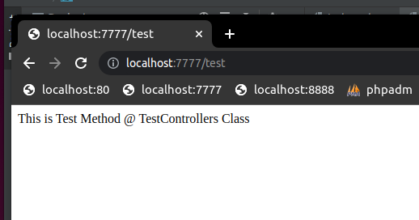

"nikic/fast-route": "^1.3" router example

## Getting started

- run `composer install` to get necessary packages
- run `php -S localhost:7777` from project root to start server
- try http://localhost:7777/test
- try http://localhost:7777/hello
- try http://localhost:7777/world
